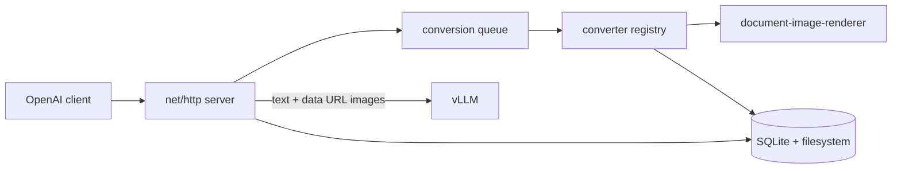
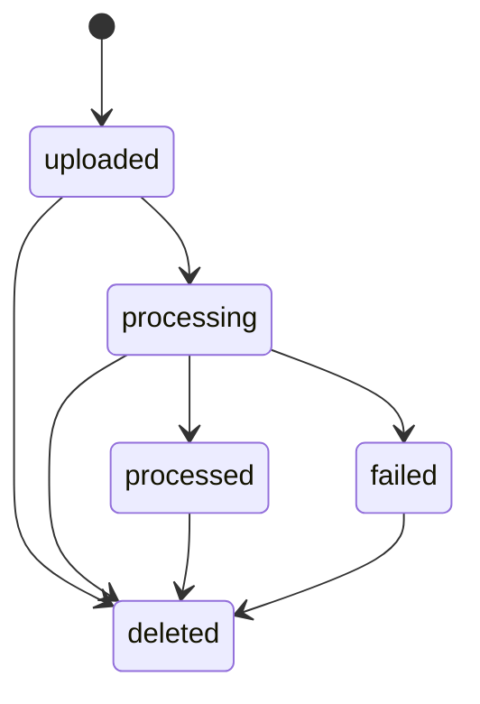
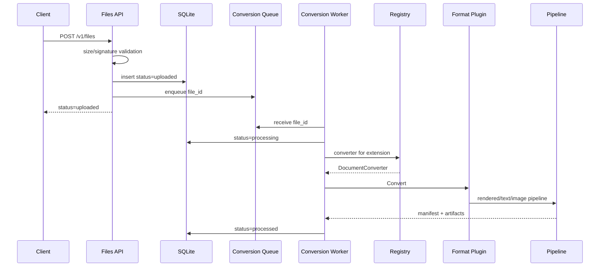

# LLM File Gateway設計

## 目的

GatewayはOpenAI互換Files APIを所有し、保存またはinline指定された文書をテキストと画像へ変換してvLLMへ転送する。

## Architecture



## Packages

| Package | Responsibility |
| --- | --- |
| `cmd/llm-file-gateway` | lifecycle、signal、HTTP server |
| `internal/config` | 環境変数の検証 |
| `internal/store` | SQLite schemaとtenant-aware CRUD |
| `internal/files` | 保存、変換queue、TTL、削除 |
| `internal/converter` | 形式検証、抽出、描画、manifest |
| `internal/server` | Files API、入力展開、認証、proxy |
| `internal/apierror` | OpenAI形式のerror |

`internal/server`はHTTP境界の責務を次のファイルへ分離する。

| Component | Responsibility |
| --- | --- |
| `server.go` | route、Files API、tenant認証、共通response |
| `inference.go` | Responses/Chatのrequest検証とcontent展開 |
| `document.go` | file参照の解決、一時変換、content part生成 |
| `file_url.go` | 公開HTTPS URLの検証、redirect、download |
| `proxy.go` | vLLMへの転送、header処理、SSE flush |

## Converter Architecture

converterは、PDF、Office、画像など専用処理が必要な形式のpluginと、全テキスト形式を扱う共通`textConverter`で構成する。形式追加時にdispatcherやpipelineへ分岐を追加しない。

```go
type DocumentConverter interface {
  Extension() string
  MediaType() string
  Validate(source string) error
  Convert(ctx context.Context, source, outputDir string, options Options) (Result, error)
}
```

| Component | Responsibility |
| --- | --- |
| `base.go` | interface、options、result、artifact、limit error |
| `registry.go` | 専用pluginとtext converter設定の登録、拡張子の正規化、検索 |
| `dispatcher.go` | 登録済み形式を選択し、未知拡張子は共通text converterへ委譲 |
| `pipeline.go` | rendered/text/imageの共通pipelineとmanifest生成 |
| `<extension>.go` | PDF、Office、画像など専用処理が必要な形式のplugin |
| `office_common.go` | Office pluginが共有するsignatureとpipeline helper |
| `text_common.go` | 全テキスト形式のconverter、plain text fallback、CSV/HTML extractor |
| `image_common.go` | image pluginが共有するdecodeとconversion helper |
| `validation.go` | signature検証の共通部品 |

registryだけが標準plugin一覧を知り、dispatcherは形式別条件分岐を持たない。PDF、Office、画像のplugin instanceは拡張子ごとの検証と変換を所有する。テキスト形式はすべて同じ`textConverter`型を使い、拡張子、media type、extractorだけをregistryで設定する。CSVはCSV extractor、HTML/HTMはHTML extractor、それ以外はplain text extractorを使う。未登録の拡張子と拡張子なしのファイルもplain text extractorへfallbackし、有効なUTF-8かつNUL byteなしの場合だけ受理する。

Goでは動的module loadingではなく、明示的なcompile-time登録を採用する。`NewRegistry`はtestや将来の構成差し替えにも利用でき、同一拡張子の二重登録をerrorにする。

## File Lifecycle



Files APIは保存後に`uploaded`を返す。`CONVERSION_WORKERS`個のworkerが変換し、manifestを永続化して`processed`へ更新する。worker数の既定値は2で、正の整数に変更できる。保持期限は作成時刻から`FILE_TTL_SECONDS`後で、既定値は300秒とする。正の整数で変更でき、Files API実行時に`expires_after`を指定する場合は`FILE_TTL_SECONDS`よりも短い値とする必要がある。Gatewayの再起動時には、SQLiteに残っている有効期限内の`uploaded`または`processing`状態のfile IDを変換queueへ追加し、変換を最初から再実行する。janitorは期限切れレコードと関連directoryを物理削除する。



queueはprocess内のbuffered channelであり、`CONVERSION_WORKERS`個のworker goroutineが共有する。起動時はSQLiteから有効期限内の`uploaded`または`processing`状態のfile IDを取得してqueueへ追加し、変換を最初から再実行する。workerとは別のjanitor goroutineが30秒ごとに期限切れfileを削除する。停止時は共通contextをcancelし、すべてのgoroutineの終了を待つ。

## Conversion

入力は選択されたpluginが拡張子に対応する基本signatureを検証する。PDFとOfficeは`document-image-renderer`の`pkg/renderer.RenderDocument`で150 DPI PNGへ描画し、抽出が有効な場合は`ExtractDocumentWithOptions`でテキストも取得する。どちらもLibreOffice timeoutは300秒とする。rendererはPDFをPDFium/WASMで直接処理し、Officeを必要に応じてLibreOfficeで一時変換する。DOC/DOCXはページ、PPT/PPTXはスライド、XLS/XLSX/XLSMはworksheetが画像単位となる。

Gatewayはrendererの既定値をそのまま使わず、`DefaultRenderOptions`を取得して必要なfieldだけを上書きする。rendererはページ単位で画像を保存し、途中失敗時に既生成画像を残す。また出力directory内の無関係なfileを削除しない。このためGatewayは専有する`derived` directoryと同階層の`manifest.json`を変換開始前に初期化し、変換が完了しなければ両方を削除する。rendererが返す`UnsupportedFormatError`、`DependencyNotFoundError`、`DocumentConversionError`、`DocumentRenderError`を含む変換errorはconverterから呼び出し元へ伝播する。

PDFと全Office形式のテキスト抽出はrendererへ委譲し、Gatewayは`ExtractResult.Text()`で結合した文書全体のテキストを一つのartifactとして保存する。rendererは抽出text partと描画画像の対応を保証しないため、テキストへpage、slide、sheet番号を割り当てない。描画画像は元文書のページ、スライド、シート単位のartifactとして順序と番号を保持する。`DOCUMENT_TEXT_EXTRACTION_ENABLED`は既定で`true`とし、`false`の場合はrendererの抽出処理を呼ばず、PDFとOfficeを画像だけのcontent partへ展開する。テキスト系は入力内容そのものであるため設定対象外とし、UTF-8を要求する。HTMLは非表示要素を除外し、未知拡張子のUTF-8テキストはplain textとして内容をそのまま保持する。JPEG/PNGは再圧縮しない。抽出を有効にした場合、文字数上限はtext-only形式だけでなく、PDFとOfficeにも描画前に適用する。

成果物は`manifest.json`、文書単位の抽出text、part単位のimageで構成する。schema version 3ではdocumentの`text_path`と各image partを独立させる。Files API成果物は`GATEWAY_DATA_DIR/files/<tenant>/<file_id>`、inline入力は`work`以下へ置き、request終了時に削除する。

Responses APIとChat Completions APIの`stream: true`は、入力展開後にvLLMへそのまま転送する。vLLMのSSE response headerとbodyを変換せず、eventを受信するたびにclientへflushする。client切断時はrequest contextを通じて上流通信をcancelする。`REQUEST_TIMEOUT_SECONDS`はstream全体の上限にも適用する。

## Inference Expansion

Responsesの`input_file`、Chat Completionsの`file`を次のpartへ置換する。

1. `<document ...>`で囲んだ抽出テキスト
2. 画像がある場合はbase64 data URL
3. 呼び出し元が指定した通常のcontent part

Responsesは`file_id`、`file_data`、`file_url`、Chatは`file_id`と`file_data`を受け付ける。`file_url`はHTTPS:443、公開IP、最大4 redirectに限定し、各redirectを再検証する。

## Authentication

任意認証ではAuthorizationをvLLMへ転送し、token hashをFiles APIのtenant IDとして使う。必須認証ではconstant-time比較でGateway keyを検証し、上流には別のvLLM keyを送る。Authorizationなしの任意認証requestは匿名tenantを共有する。

設定はprocessの環境変数から読み込み、Gateway自身は`.env`を読み込まない。local実行ではshellからexportし、Compose実行ではComposeが`.env`を展開してcontainerへ渡す。必須認証では`GATEWAY_API_KEY`と`VLLM_API_KEY`の両方を必須とし、不足時は起動を拒否する。`/v1`以下はFiles APIを含めて認証対象とするが、`GET /health`は認証せずプロセスの稼働状態だけを返す。

## Proxy

Files、Responses、Chat以外の`/v1/*`はmethod、query、body、end-to-end headerを維持して転送する。hop-by-hop headerは除外する。Files配下の未知methodは転送しない。

## Logging

`log/slog`の構造化text logを標準エラーへ出力する。公開設定`LOGLEVEL`はseverityではなく昇順のverbosityとし、`0`はINFO以上、`1`はDEBUG以上、`2`はqueue操作など高頻度の内部状態も含める。内部ではverbosityごとにslog levelを4ずつ下げてfilterするが、出力時はV1/V2ともlevel名を`DEBUG`へ正規化し、`verbosity` fieldで区別する。WARNは回復可能な欠落・cleanup・外部URL取得失敗、ERRORはDB、artifact、変換、vLLM通信など処理を完了できない内部・依存障害に使う。通常の入力検証4xxは原則として記録せず、運用調査が必要な`file_not_found`だけWARNとする。文書本文、API key、完全な外部URLはfieldへ含めない。

## Operational Boundary

単一process、SQLite、local filesystemを運用単位とする。conversion workerはprocess内で複数起動できるが、複数replica間のqueue共有、推論中file lease、rate limit、malware scan、高可用化は対象外である。