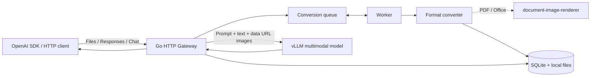
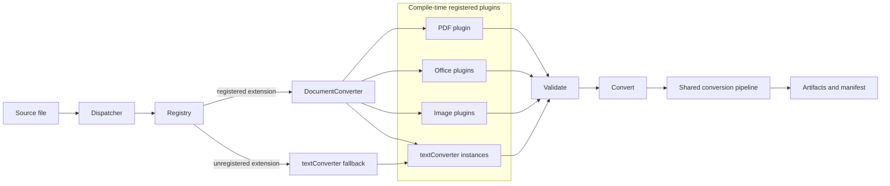
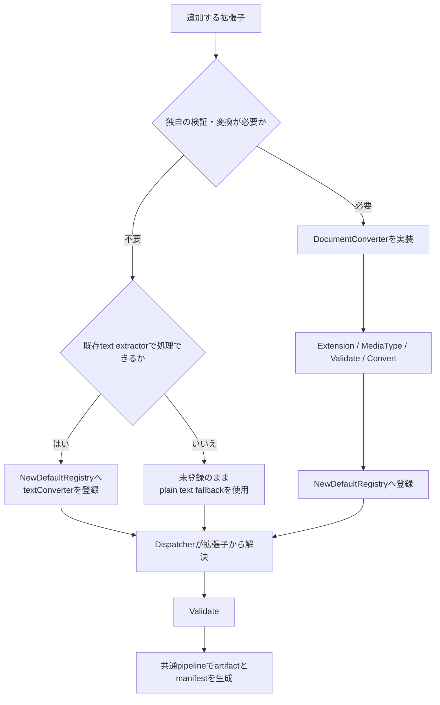
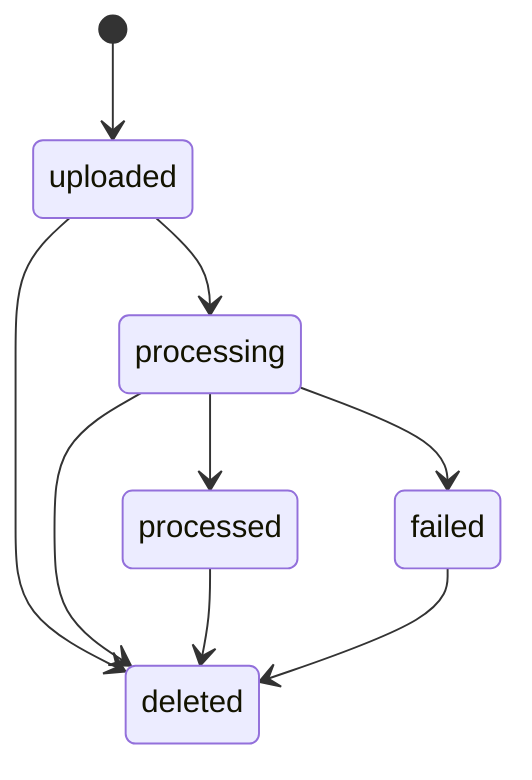
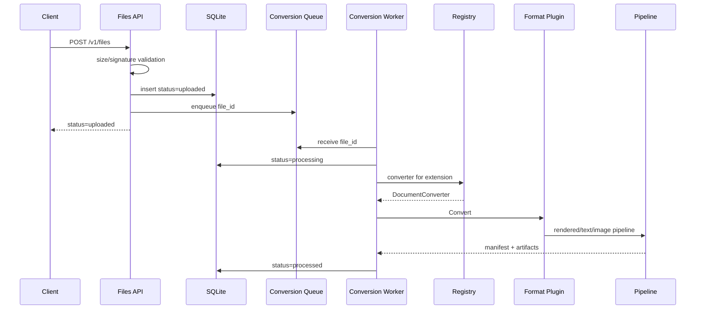

# LLM File Gateway設計

## 目的

GatewayはOpenAI互換Files APIを所有し、保存またはinline指定された文書をテキストと画像へ変換してvLLMへ転送する。

## Architecture



1. Files APIがファイルを保存し、`status: "uploaded"`を返します。
2. バックグラウンドworkerが形式別converterを選択し、text/image artifactを生成します。
3. 変換完了後、Fileオブジェクトが`status: "processed"`になります。
4. ResponsesまたはChat Completionsのファイル参照を、抽出テキストとdata URL画像へ展開します。
5. 展開後のリクエストを同種のvLLM APIへ転送します。

元文書とGatewayの`file_id`はvLLMへ渡しません。inlineの`file_data`と`file_url`はリクエスト中だけ一時保存し、応答またはエラーの後に削除します。Files APIで保存したファイルは`FILE_TTL_SECONDS`後に削除します。

## Packages

| Package | Responsibility |
| --- | --- |
| `cmd/llm-file-gateway` | process lifecycleとHTTP server起動 |
| `internal/config` | 環境変数の検証 |
| `internal/store` | SQLite schemaとtenant-aware CRUD |
| `internal/files` | ファイルの保存、conversion queue、worker、janitor |
| `internal/converter` | plugin registry、dispatcher、pipeline、形式別converter |
| `internal/server` | Files/Responses/Chat API、文書展開、公開URL取得、vLLM proxy |
| `internal/apierror` | OpenAI形式のerror |
| `example` | Go利用例とsample文書 |

`internal/server`はHTTP境界の責務を次のファイルへ分離する。

| Component | Responsibility |
| --- | --- |
| `server.go` | route、Files API、tenant認証、共通response |
| `inference.go` | Responses/Chatのrequest検証とcontent展開 |
| `document.go` | file参照の解決、一時変換、content part生成 |
| `file_url.go` | 公開HTTPS URLの検証、redirect、download |
| `proxy.go` | vLLMへの転送、header処理、SSE flush |


## Converter Architecture

converterは、PDF、Office、画像など専用処理が必要な形式のpluginと、全テキスト形式を扱う共通`textConverter`で構成する。PDFとOffice形式ファイルのテキスト抽出および画像変換は`document-image-renderer`へ委譲する。テキスト形式は個別pluginを持たず、共通text converterで処理する。(CSVとHTMLだけは同じconverterへ抽出関数を設定)。
未知の拡張子や拡張子がないファイルも、有効なUTF-8でNUL byteを含まなければプレーンテキストとして処理する。
形式追加時にdispatcherやpipelineへ分岐を追加しない。

```go
type DocumentConverter interface {
  Extension() string
  MediaType() string
  Validate(source string) error
  Convert(ctx context.Context, source, outputDir string, options Options) (Result, error)
}
```



| Component | Responsibility |
| --- | --- |
| `base.go` | interface、options、result、artifact、limit error |
| `registry.go` | 専用pluginとtext converter設定の登録、拡張子の正規化、検索 |
| `dispatcher.go` | pathからconverterを解決し、未知拡張子は共通text converterへ委譲 |
| `pipeline.go` | rendered/text/imageの共通pipelineとmanifest生成 |
| `<extension>.go` | PDF、Office、画像など専用処理が必要な形式のplugin |
| `office_common.go` | Office pluginが共有するsignatureとpipeline helper |
| `text_common.go` | 全テキスト形式のconverter、plain text fallback、CSV/HTML extractor |
| `image_common.go` | image pluginが共有するdecodeとconversion helper |
| `validation.go` | signature検証の共通部品 |

registryだけが標準plugin一覧を知り、dispatcherは形式別条件分岐を持たずconverterの解決だけを行う。`NewDefaultRegistry`をprocess起動時に呼び、生成したdispatcherをFiles serviceへ注入する。package globalのregistryやdispatcherは持たない。検証と変換は解決済みの`DocumentConverter`を呼び出す。PDF、Office、画像のplugin instanceは拡張子ごとの検証と変換を所有する。テキスト形式はすべて同じ`textConverter`型を使い、拡張子、media type、extractorだけをregistryで設定する。CSVはCSV extractor、HTML/HTMはHTML extractor、それ以外はplain text extractorを使う。未登録の拡張子と拡張子なしのファイルもplain text extractorへfallbackし、有効なUTF-8かつNUL byteなしの場合だけ受理する。

Goでは動的module loadingではなく、明示的なcompile-time登録を採用する。`NewRegistry`はtestや将来の構成差し替えにも利用でき、同一拡張子の二重登録をerrorにする。

### Adding a Format

追加する拡張子の特性に応じて、次のいずれかを選ぶ。
拡張子ごとの分岐をFiles service、推論resolver、dispatcherへ追加しない。



- UTF-8テキストをそのまま入力として扱う形式は登録不要である。未登録拡張子はplain text fallbackが処理し、UTF-8でNUL byteを含まない場合だけ受理する。
- 既存のtext converterと抽出方法を共有できる形式は、`NewDefaultRegistry`へ`newTextConverter`を追加する。plain text、CSV、HTMLのいずれのextractorを使うかと、適切なmedia typeを指定する。
- 独自の検証、テキスト抽出、画像化が必要な形式は`DocumentConverter`を実装する。`Extension`は一つの拡張子だけを返し、`Validate`で形式固有の入力検証を行い、`Convert`でartifactとmanifestを生成する。同じ実装を複数拡張子で使う場合も、拡張子ごとにconverter instanceを登録する。

専用converterの実装では、既存の共通処理を優先して再利用する。PDF/Officeの描画とpage単位artifactには`convertRenderedDocument`、テキストのみの形式には`convertTextDocument`、元画像を保持する形式には`convertImageDocument`、manifestの生成には`writeResult`を使用する。実装後は`registry.go`の`NewDefaultRegistry`へ登録し、拡張子ごとのregistry test、検証失敗時のtest、変換結果のtestを追加する。画像化またはOffice依存の形式では、対応するintegration testも追加する。

## File Lifecycle



Files APIは保存後に`uploaded`を返す。`CONVERSION_WORKERS`個のworkerが変換し、manifestを永続化して`processed`へ更新する。worker数の既定値は2で、正の整数に変更できる。保持期限は作成時刻から`expires_after.seconds`後とし、未指定時は`FILE_TTL_SECONDS`（既定300秒）を使用する。`expires_after`は`anchor=created_at`と1秒以上`FILE_TTL_SECONDS`以下の秒数を要求する。Gatewayの再起動時には、SQLiteに残っている有効期限内の`uploaded`または`processing`状態のfile IDを変換queueへ追加し、変換を最初から再実行する。janitorは期限切れレコードと関連directoryを物理削除し、成功をDEBUG levelで記録する。



queueはprocess内のbuffered channelであり、`CONVERSION_WORKERS`個のworker goroutineが共有する。新規uploadでは最初に解決した`DocumentConverter`をfile IDとともにqueueへ追加し、workerで再解決しない。起動時はSQLiteから有効期限内の`uploaded`または`processing`状態のfile IDを取得してqueueへ追加し、source pathからconverterを一度解決して変換を最初から再実行する。workerとは別のjanitor goroutineが30秒ごとに期限切れfileを削除する。停止時は共通contextをcancelし、すべてのgoroutineの終了を待つ。

## Conversion

入力は選択されたpluginが拡張子に対応する基本signatureを検証する。PDFとOfficeは`document-image-renderer`の`pkg/renderer.RenderDocument`で150 DPI PNGへ描画し、抽出が有効な場合は`ExtractDocumentWithOptions`でテキストも取得する。どちらもLibreOffice timeoutは300秒とする。rendererはPDFをPDFium/WASMで直接処理し、Officeを必要に応じてLibreOfficeで一時変換する。DOC/DOCXはページ、PPT/PPTXはスライド、XLS/XLSX/XLSMはworksheetが画像単位となる。

Gatewayは`document-image-renderer`の既定値をそのまま使わず、`DefaultRenderOptions`を取得して必要なfieldだけを上書きする。`document-image-renderer`はページ単位で画像を保存し、途中失敗時に既生成画像を残す。また出力directory内の無関係なfileを削除しない。このためGatewayは専有する`derived` directoryと同階層の`manifest.json`を変換開始前に初期化し、変換が完了しなければ両方を削除する。`document-image-renderer`が返す`UnsupportedFormatError`、`DependencyNotFoundError`、`DocumentConversionError`、`DocumentRenderError`を含む変換errorはconverterから呼び出し元へ伝播する。

PDFと全Office形式のテキスト抽出は`document-image-renderer`へ委譲し、Gatewayは`ExtractResult.Text()`で結合した文書全体のテキストを一つのartifactとして保存する。`document-image-renderer`は抽出text partと描画画像の対応を保証しないため、テキストへpage、slide、sheet番号を割り当てない。描画画像は元文書のページ、スライド、シート単位のartifactとして順序と番号を保持する。`DOCUMENT_TEXT_EXTRACTION_ENABLED`は既定で`true`とし、`false`の場合は`document-image-renderer`の抽出処理を呼ばず、PDFとOfficeを画像だけのcontent partへ展開する。テキスト系は入力内容そのものであるため設定対象外とし、UTF-8を要求する。HTMLは非表示要素を除外し、未知拡張子のUTF-8テキストはplain textとして内容をそのまま保持する。JPEG/PNGは再圧縮しない。抽出を有効にした場合、文字数上限はtext-only形式だけでなく、PDFとOfficeにも描画前に適用する。

成果物は`manifest.json`、文書単位の抽出text、part単位のimageで構成する。schema version 3ではdocumentの`text_path`と各image partを独立させる。Files API成果物は`GATEWAY_DATA_DIR/files/<tenant>/<file_id>`、inline入力は`work`以下へ置き、request終了時に削除する。

Responses APIとChat Completions APIの`stream: true`は、入力展開後にvLLMへそのまま転送する。vLLMのSSE response headerとbodyを変換せず、eventを受信するたびにclientへflushする。client切断時はrequest contextを通じて上流通信をcancelする。`REQUEST_TIMEOUT_SECONDS`はstream全体の上限にも適用する。

## Inference Expansion

Responsesの`input_file`、Chat Completionsの`file`を次のpartへ置換する。

1. `<document ...>`で囲んだ抽出テキスト
2. 画像がある場合はbase64 data URL
3. 呼び出し元が指定した通常のcontent part

Responsesは`file_id`、`file_data`、`file_url`、Chatは`file_id`と`file_data`を受け付ける。`file_url`はHTTPS:443、公開IP、最大4 redirectに限定し、各redirectを再検証する。

## Authentication

認証無効時はクライアントのAuthorizationを検証せず、Files APIでは全requestが共有tenantを使う。起動時に既存のtenantも共有tenantへ集約する。必須認証ではconstant-time比較でGateway keyを検証する。どちらの場合もクライアントのAuthorizationは上流へ転送せず、vLLMには`VLLM_API_KEY`を送る。

設定はprocessの環境変数から読み込み、Gateway自身は`.env`を読み込まない。local実行ではshellからexportし、Compose実行ではComposeが`.env`を展開してcontainerへ渡す。`VLLM_API_KEY`は常に必須とし、必須認証では`GATEWAY_API_KEY`も要求する。`/v1`以下はFiles APIを含めて認証対象とするが、`GET /health`は認証せずプロセスの稼働状態だけを返す。

## Proxy

Files、Responses、Chat以外の`/v1/*`はmethod、query、body、end-to-end headerを維持して転送する。hop-by-hop headerは除外する。Files配下の未知methodは転送しない。

## Logging

`log/slog`の構造化text logを標準エラーへ出力する。公開設定`LOGLEVEL`はseverityではなく昇順のverbosityとし、`0`はINFO以上、`1`はDEBUG以上、`2`はqueue操作など高頻度の内部状態も含める。内部ではverbosityごとにslog levelを4ずつ下げてfilterするが、出力時はV1/V2ともlevel名を`DEBUG`へ正規化する。WARNは4xxの入力検証・回復可能な欠落・cleanup・外部URL取得失敗、ERRORはDB、artifact、変換、vLLM通信など処理を完了できない内部・依存障害に使う。4xxログにはHTTP status、error code、paramを含める。文書本文、API key、完全な外部URLはfieldへ含めない。

## Operational Boundary

単一process、SQLite、local filesystemを運用単位とする。conversion workerはprocess内で複数起動できるが、複数replica間のqueue共有、推論中file lease、rate limit、malware scan、高可用化は対象外である。