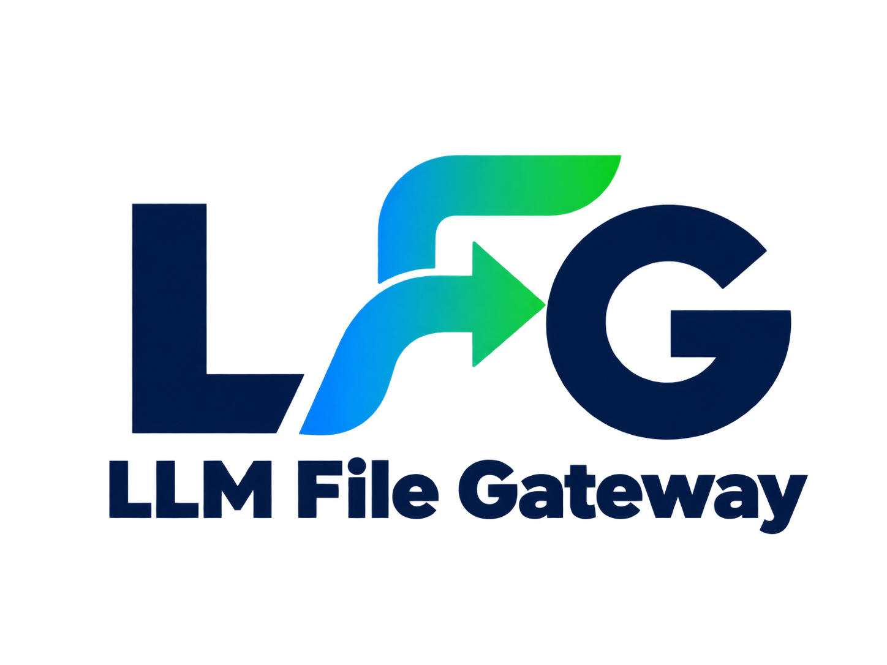

# LLM File Gateway



[vLLMのAPI](https://docs.vllm.ai/en/stable/serving/online_serving/)に対して[OpenAI Files API](https://developers.openai.com/api/reference/resources/files)との互換性を持たせるGatewayです。
PDF、Officeファイル、テキスト、画像などのファイルをOpenAI Files API互換のAPIでアップロードすると画像変換およびテキスト抽出が行われ、アーティファクトとして保存されます。アーティファクトを生成する際に`file_id`が発行されます。
`file_id`をResponses APIまたはChat Completions APIに付加することで、バックエンドにFiles APIでアップロードしたファイルに基づくアーティファクトを画像(base64)および抽出テキストとして転送することができます。

ファイル画像変換には[document-image-renderer](https://github.com/mochizuki875/document-image-renderer)を使用します。

## Features
- OpenAI互換のFiles API
- Responses API、Chat Completions APIへの`file_id`、base64の`file_data`、公開HTTPSの`file_url`によるファイル入力
- `GATEWAY_API_KEY`によるGatewayでのToken認証

## Limitations
- 複数の`GATEWAY_API_KEY`による認証(マルチテナント)には未対応です
- HTMLやMarkdownにおける外部URLや埋め込み画像は取得しません
- Officeファイルのフォントやレイアウト、改ページの完全な再現は保証しません
- GatewayはステートフルなAll-in-One構成になっているため、複数インスタンスによるスケーリングには対応していません
- OpenAI Files APIのファイル変換、token使用量、回答品質との完全な一致は保証しません
- Responses APIの`input_file.detail`は受理しますが、`low`/`high`の変換品質には反映しません(ファイルは常にGatewayの既定の変換設定で処理され、モデルには`detail: "auto"`の画像として転送されます)
- LLM File GatewayはOpenAI Files APIとの互換性を持たせることを目的としているため、一般的なGatewayに期待されるrate limit、request size制限などの機能は含まれていません

## Supported APIs

| API | Endpoint |
| --- | --- |
| Health | `GET /health` |
| Create file | `POST /v1/files` |
| List files | `GET /v1/files` |
| Retrieve file | `GET /v1/files/{file_id}` |
| Retrieve content | `GET /v1/files/{file_id}/content` |
| Delete file | `DELETE /v1/files/{file_id}` |
| Responses | `POST /v1/responses` |
| Chat Completions | `POST /v1/chat/completions` |
| Other vLLM APIs | `/v1/*` (Passed through)

- `GET /health`はプロセスの稼働だけを示し、SQLite、LibreOffice、vLLMへの接続性は検査しません。
- Files APIでファイルをアップロードした際の画像変換およびテキスト抽出は非同期で行われます。推論で参照する前に`GET /v1/files/{file_id}`で処理状態(`status: "processed"`)を確認してください。変換中は`409 file_not_ready`、失敗後は`422 file_processing_failed`を返します。
- Files APIが所有するパスの未対応メソッドはvLLMへ転送せず、`405`を返します。

## Supported Formats

| 種別 | 拡張子 | モデルへの入力 |
| --- | --- | --- |
| PDF | `.pdf` | ファイル全体の抽出テキストとページ画像を生成し、モデルへの入力として使用 |
| Word | `.doc`, `.docx` | ファイル全体の抽出テキストとページ画像を生成し、モデルへの入力として使用 |
| PowerPoint | `.ppt`, `.pptx` | ファイル全体の抽出テキストとスライド画像を生成し、モデルへの入力として使用 |
| Excel | `.xls`, `.xlsx`, `.xlsm` | ファイル全体の抽出テキストとシート画像を生成し、モデルへの入力として使用 |
| Text | `.txt`, `.md`, `.markdown`, `.json`, `.jsonl`, `.yaml`, `.yml`, `.go`など | UTF-8の内容をテキストとして生成し、モデルへの入力として使用 |
| Structured text | `.csv`, `.html`, `.htm` | CSVを行形式に変換、HTMLから可視テキストを抽出し、モデルへの入力として使用 |
| Image | `.jpeg`, `.jpg`, `.png` | 元形式の画像をそのままモデルへの入力として使用 |

- `DOCUMENT_TEXT_EXTRACTION_ENABLED=false`を設定すると、PDFとOfficeファイルからのテキスト抽出は行わず、変換画像だけをモデルへ送信します。
- Officeファイルのマクロは実行しません。

## Requirements

- Go 1.27以降
- OpenAI互換APIを提供するvLLMサーバー
- マルチモーダル対応モデル
- [document-image-renderer](https://github.com/mochizuki875/document-image-renderer)の動作要件

## Build

このリポジトリをクローンし、ビルドします。

```bash
git clone https://github.com/mochizuki875/llm-file-gateway.git
make build
```

## Environment Setup
`.env.example`をコピーし`.env`を作成します。
`.env`へ少なくとも必須パラメータを設定してください。

```bash
cp .env.example .env
```

## Configuration

Gatewayは設定値をプロセスの環境変数から読み取ります。

| Environment variable | Required | Default | Description |
| --- | --- | --- | --- |
| `VLLM_MODEL` | Yes | - | クライアントからのリクエストで許可するモデル名(vLLMのモデル名と一致する必要があります) |
| `VLLM_BASE_URL` | Yes | - | `/v1`で終わるvLLMのURL |
| `GATEWAY_HOST` | No | `127.0.0.1` | Gatewayの待受けホスト(全てのネットワークインターフェースで待ち受ける場合は`0.0.0.0`) |
| `GATEWAY_PORT` | No | `8080` | Gatewayの待受けポート |
| `GATEWAY_AUTH_REQUIRED` | No | `false` | GatewayでBearer tokenを検証するか |
| `GATEWAY_API_KEY` | Conditional | - | Gateway認証用APIキー |
| `VLLM_API_KEY` | Yes | - | vLLM認証用APIキー |
| `GATEWAY_DATA_DIR` | No | `gateway-data` | SQLiteとファイルの保存先ディレクトリ |
| `FILE_TTL_SECONDS` | No | `300` | デフォルトのファイル保持期間(sec)および`expires_after.seconds`で指定可能な上限値（`0`で無制限） |
| `MAX_FILE_BYTES` | No | `52428800`(50 MiB) | 1ファイルの最大サイズ(bytes)（`0`で無制限） |
| `MAX_REQUEST_BODY_BYTES` | No | `MAX_FILE_BYTES`の4倍 | 推論リクエスト(`/v1/responses`、`/v1/chat/completions`)のボディ全体の最大サイズ(bytes)。複数の`file_data`を含む場合の合計上限（`0`で無制限） |
| `MAX_DOCUMENT_PAGES` | No | `50` | Gatewayで受け付けるPDF/Officeの最大ページ数（`0`で無制限） |
| `MAX_DOCUMENT_TEXT_CHARS` | No | `500000` | 1ファイルから抽出するテキストの最大文字数（`0`で無制限） |
| `DOCUMENT_DPI` | No | `300` | PDF/Officeを画像へ変換する際の解像度(DPI)。1〜1200の整数 |
| `DOCUMENT_TEXT_EXTRACTION_ENABLED` | No | `true` | PDFとOfficeからテキストを抽出するか |
| `CONVERSION_WORKERS` | No | `2` | 並行してファイルを変換するworker数。正の整数で変更可能 |
| `REQUEST_TIMEOUT_SECONDS` | No | `300` | vLLM通信のtimeout。streamingではstream全体に適用（`0`で無制限） |
| `LOGLEVEL` | No | `0` | ログverbosity（`0`: 通常、`1`: DEBUG、`2`: 高頻度の詳細ログ） |

- `GATEWAY_AUTH_REQUIRED=true`を設定した場合はGatewayでの認証が有効となり、`GATEWAY_API_KEY`の設定が必須となります。
- GatewayからvLLMへの認証は`VLLM_API_KEY`を用いて行われるため、Gatewayに送信された`OPENAI_API_KEY`は転送されません。(`VLLM_API_KEY`は常に必須です。)
- `GET /health`は認証対象外です。
- `DOCUMENT_TEXT_EXTRACTION_ENABLED=true`の場合、画像変換に加えてテキスト抽出を行い、両方をバックエンドに送信します。
- クライアントが指定するファイル保持期間(`expires_after.seconds`)の上限は`FILE_TTL_SECONDS`（`0`で無制限）です。未指定の場合は`FILE_TTL_SECONDS`に設定された値が適用されます。

## Running the Gateway

`.env`で定義した値を環境変数として設定し、Gatewayを起動します。

```bash
set -a
. ./.env
set +a

go run ./cmd/llm-file-gateway
```

Gatewayにリクエストを送信します。

```bash
# Check the health of the Gateway
curl -sS --fail http://localhost:8080/health

# Check the available models from the Gateway
if [[ "${GATEWAY_AUTH_REQUIRED:-false}" == "true" ]]; then
  CLIENT_API_KEY="$GATEWAY_API_KEY"
else
  CLIENT_API_KEY="$VLLM_API_KEY"
fi
curl -sS --fail http://localhost:8080/v1/models \
  -H "Authorization: Bearer $CLIENT_API_KEY" | jq .
```

## Docker

公開ポートは`GATEWAY_DOCKER_PORT=18080 docker compose up --build -d`のように変更できます。

Composeはコンテナ内のGatewayを`0.0.0.0:8080`で待ち受けさせ、カレントディレクトリの`.env`を展開してコンテナへ渡します。保存データを永続化するvolumeは既定のCompose構成に含まれないため、コンテナを削除するとSQLiteと保存ファイルも失われます。

```bash
docker compose up --build -d
docker compose ps
curl --fail http://localhost:8080/health
docker compose down
```

## Usage

クライアントからGatewayをOpenAI互換APIの接続先として使用します。

環境変数を設定します。
```bash
set -a
. ./.env
set +a

export OPENAI_BASE_URL=http://localhost:8080/v1
if [[ "${GATEWAY_AUTH_REQUIRED:-false}" == "true" ]]; then
  export OPENAI_API_KEY="$GATEWAY_API_KEY"
else
  export OPENAI_API_KEY=unused
fi
export OPENAI_MODEL="$VLLM_MODEL"
```

### Python Client Example

仮想環境を作成し有効化します。

```bash
cd example
python -m venv .venv
source .venv/bin/activate
pip install -r requirements.txt
```

Pythonスクリプトを実行します。
```bash
# Run the Python script to summarize the uploaded file
python openai_file_summary.py
# Streaming response
python openai_file_summary_stream.py
```

### curl

curlコマンドを用いてファイルのアップロード、変換完了待ち、Responses APIによる要約、削除を順に実行します。

```bash
cd example
DOCUMENT=samplefile.docx

# Upload the document to the Gateway
FILE_ID=$(curl --fail --silent "$OPENAI_BASE_URL/files" \
  -H "Authorization: Bearer $OPENAI_API_KEY" \
  -F purpose=user_data \
  -F "file=@$DOCUMENT" | jq -r .id)
echo "Uploaded: $FILE_ID"

# Wait until the document is processed by the Gateway
while true; do
  FILE_STATUS=$(curl --fail --silent "$OPENAI_BASE_URL/files/$FILE_ID" \
    -H "Authorization: Bearer $OPENAI_API_KEY" | jq -r .status)
  [[ "$FILE_STATUS" == "processed" ]] && break
  [[ "$FILE_STATUS" == "error" ]] && { echo "Conversion failed" >&2; exit 1; }
  sleep 1
done

# Summarize the document using the Responses API
curl --fail --silent "$OPENAI_BASE_URL/responses" \
  -H "Authorization: Bearer $OPENAI_API_KEY" \
  -H 'Content-Type: application/json' \
  -d "{\"model\":\"$OPENAI_MODEL\",\"input\":[{\"role\":\"user\",\"content\":[{\"type\":\"input_file\",\"file_id\":\"$FILE_ID\"},{\"type\":\"input_text\",\"text\":\"この文書を簡潔に要約してください。\"}]}]}" | \
  jq '{id, status, output_text: [.output[].content[] | select(.type == "output_text").text] | join("")}'

# Delete the document from the Gateway
curl --fail --silent -X DELETE "$OPENAI_BASE_URL/files/$FILE_ID" \
  -H "Authorization: Bearer $OPENAI_API_KEY"
```

### Input Forms

| API | Input | Shape |
| --- | --- | --- |
| Responses | Uploaded file | `{"type":"input_file","file_id":"file_..."}` |
| Responses | Inline base64 | `{"type":"input_file","filename":"document.pdf","file_data":"..."}` |
| Responses | Public URL | `{"type":"input_file","file_url":"https://example.com/document.pdf"}` |
| Chat Completions (*)| Uploaded file | `{"type":"file","file":{"file_id":"file_..."}}` |
| Chat Completions | Inline base64 | `{"type":"file","file":{"filename":"document.pdf","file_data":"..."}}` |

一つの参照には`file_id`、`file_data`、`file_url`のいずれか一つだけを指定します。Chat Completionsでは`file_url`を使用できません。

> **Note**: OpenAIのChat Completions APIには、ファイルを直接指定するための標準入力形式(*)はありません。LLM File Gatewayでは独自拡張として、Chat Completions APIでも`file_id`または`file_data`によるファイル参照を受け付けます。参照されたファイルはResponses APIと同様に、抽出テキストとbase64画像のcontent partへ展開されます。

## Testing

```bash
make test
make verify
make test-integration
```

`make test`は外部rendererを使うケースを除く短縮testです。`make verify`は同じtestをrace detector付きで実行し、続けて`go vet`と`make lint`を実行します。どちらもvLLMをmockするためGPU serverは不要です。

`make test-integration`はPDF/Officeの実変換を含み、LibreOfficeと必要なフォントが必要です。外部vLLMを使うE2E確認には[Python Client Example](#python-client-example)を使用できます。

## Security

- 登録済み拡張子の基本signature、テキストのUTF-8とNUL byte、画像形式を検証します。
- `file_url`はHTTPSの443番ポートと公開IPだけを許可し、redirectごとに再検証します。
- 保存ファイルは`FILE_TTL_SECONDS`で設定した保持期間経過後に削除します。
- Gateway認証無効時の保存領域は全クライアントで共有されます。
- ファイル由来のテキストを信頼しないようGatewayでsystem instructionを追加します。
- ログへファイルに記載された本文やAPI keyを明示的には出力しません。
- TLS終端をサポートしません。
- parserの完全なsandbox、保持ファイルの暗号化はサポートしません。

## Contributing

変更は小さく保ち、関連するtestとファイルを更新してください。変換結果に影響する変更では、PDFと各Office形式のintegration testを実行し、LibreOffice、フォント、`document-image-renderer`のversion差も考慮してください。

詳細は[DESIGN.md](DESIGN.md)を参照してください。

## License

Apache License 2.0。全文は[LICENSE](LICENSE)を参照してください。