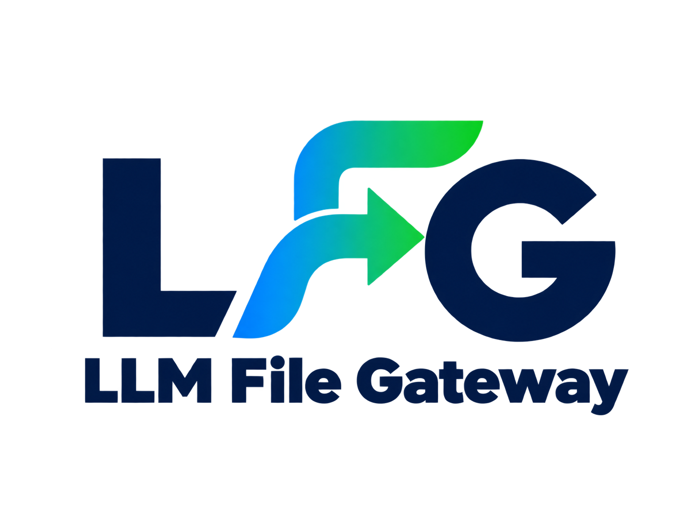

# LLM File Gateway

English | [日本語](docs/README-ja.md)



This is a gateway that provides [OpenAI Files API](https://developers.openai.com/api/reference/resources/files) compatibility in front of the [vLLM API](https://docs.vllm.ai/en/stable/serving/online_serving/).
When files such as PDF, Office documents, text, and images are uploaded via the OpenAI Files API-compatible API, a `file_id` is issued at upload time, and image conversion and text extraction are performed asynchronously and stored as artifacts.
By attaching the `file_id` to a Responses API or Chat Completions API request, artifacts based on files uploaded via the Files API can be forwarded to the backend as images (base64) and extracted text.

File image conversion uses [document-image-renderer](https://github.com/mochizuki875/document-image-renderer).

## Features
- OpenAI-compatible Files API
- File input to the Responses API and Chat Completions API via `file_id`, base64 `file_data`, and public HTTPS `file_url`
- Token authentication at the Gateway via `GATEWAY_API_KEY`

## Limitations
- Does not support authentication with multiple `GATEWAY_API_KEY`s (multi-tenancy)
- Does not fetch external URLs or embedded images in HTML or Markdown
- Does not guarantee complete reproduction of fonts, layouts, or page breaks in Office files
- The Gateway has a stateful all-in-one configuration and does not support scaling across multiple instances
- Does not guarantee an exact match with the OpenAI Files API in terms of file conversion, token usage, or response quality
- The Responses API's `input_file.detail` is accepted but is not reflected in `low`/`high` conversion quality (files are always processed with the Gateway's default conversion settings and forwarded to the model as images with `detail: "auto"`)

## Supported APIs

| API | Endpoint |
| --- | --- |
| Health | `GET /health` |
| Create file | `POST /v1/files` |
| List files | `GET /v1/files` |
| Retrieve file | `GET /v1/files/{file_id}` |
| Retrieve content | `GET /v1/files/{file_id}/content` |
| Delete file | `DELETE /v1/files/{file_id}` |
| Responses | `POST /v1/responses` |
| Chat Completions | `POST /v1/chat/completions` |
| Other vLLM APIs | `/v1/*` (Passed through) |

- `GET /health` only indicates that the process is running; it does not check connectivity to SQLite, LibreOffice, or vLLM.
- Image conversion and text extraction when uploading files via the Files API are performed asynchronously. Inference requests that reference a `file_id` waiting for or undergoing conversion wait internally until the conversion completes and are then forwarded to vLLM.
- The `status` field of `GET /v1/files/{file_id}` shows the file state. The `status` field is one of `uploaded` (stored; waiting for or undergoing conversion), `processed` (conversion complete), or `error` (conversion failed). Conversion failures return `422 file_processing_failed`, and deletion or expiration while waiting returns `404 file_not_found`.
- Unsupported methods on paths owned by the Files API return `405` without being forwarded to vLLM.

## Supported Formats

| Type | Extensions | Model input |
| --- | --- | --- |
| PDF | `.pdf` | Generates extracted text and page images for the entire file, used as model input |
| Word | `.doc`, `.docx` | Generates extracted text and page images for the entire file, used as model input |
| PowerPoint | `.ppt`, `.pptx` | Generates extracted text and slide images for the entire file, used as model input |
| Excel | `.xls`, `.xlsx`, `.xlsm` | Generates extracted text and sheet images for the entire file, used as model input |
| Text | `.txt`, `.md`, `.markdown`, `.json`, `.jsonl`, `.yaml`, `.yml`, `.go`, etc. | Generates the UTF-8 content as text, used as model input |
| Structured text | `.csv`, `.html`, `.htm` | Converts CSV into row format and extracts visible text from HTML, used as model input |
| Image | `.jpeg`, `.jpg`, `.png` | Uses the original image as-is as model input |

- Setting `DOCUMENT_TEXT_EXTRACTION_ENABLED=false` disables text extraction from PDF and Office files, sending only the converted images to the model.
- Macros in Office files are not executed.

## Requirements

- Go 1.27 or later
- A vLLM server that provides an OpenAI-compatible API
- A multimodal-capable model
- Runtime requirements of [document-image-renderer](https://github.com/mochizuki875/document-image-renderer)

## Build

Clone this repository and build it.

```bash
git clone https://github.com/mochizuki875/llm-file-gateway.git
make build
```

## Environment Setup
Copy `.env.example` to create `.env`.
Set at least the required parameters in `.env`.

```bash
cp .env.example .env
```

## Configuration

The Gateway reads configuration values from the process environment variables.

| Environment variable | Required | Default | Description |
| --- | --- | --- | --- |
| `VLLM_MODEL` | Yes | - | Model name allowed in requests from clients (must match the vLLM model name) |
| `VLLM_BASE_URL` | Yes | - | vLLM URL ending with `/v1` |
| `GATEWAY_HOST` | No | `127.0.0.1` | Host the Gateway listens on (`0.0.0.0` to listen on all network interfaces) |
| `GATEWAY_PORT` | No | `8080` | Port the Gateway listens on |
| `GATEWAY_AUTH_REQUIRED` | No | `false` | Whether the Gateway validates Bearer tokens |
| `GATEWAY_API_KEY` | Conditional | - | API key for Gateway authentication |
| `VLLM_API_KEY` | Yes | - | API key for vLLM authentication |
| `GATEWAY_DATA_DIR` | No | `gateway-data` | Directory where SQLite and files are stored |
| `FILE_TTL_SECONDS` | No | `300` | Default file retention period (sec) and the upper limit that can be specified in `expires_after.seconds` (`0` for unlimited) |
| `MAX_FILE_BYTES` | No | `52428800` (50 MiB) | Maximum size of a single file (bytes) (`0` for unlimited) |
| `MAX_REQUEST_BODY_BYTES` | No | 4x `MAX_FILE_BYTES` | Maximum received body size (bytes) of inference requests (`0` for unlimited) |
| `MAX_DOCUMENT_PAGES` | No | `50` | Maximum number of PDF/Office pages accepted by the Gateway (`0` for unlimited) |
| `MAX_DOCUMENT_TEXT_CHARS` | No | `500000` | Maximum number of characters extracted from a single file (`0` for unlimited) |
| `MAX_DOCUMENT_PDF_BYTES` | No | `134217728` (128 MiB) | Maximum size of PDFs processed by the renderer (bytes) (`0` for unlimited) |
| `MAX_DOCUMENT_PAGE_WIDTH` | No | `20000` | Maximum width (px) of a rendered page (`0` for unlimited) |
| `MAX_DOCUMENT_PAGE_HEIGHT` | No | `20000` | Maximum height (px) of a rendered page (`0` for unlimited) |
| `MAX_DOCUMENT_PAGE_PIXELS` | No | `200000000` | Maximum number of pixels of a rendered page (`0` for unlimited) |
| `MAX_DOCUMENT_PIXELS` | No | `1000000000` | Maximum total number of pixels for an entire document (`0` for unlimited) |
| `MAX_DOCUMENT_OOXML_MEMBERS` | No | `10000` | Maximum number of members in an OOXML archive (`0` for unlimited) |
| `MAX_DOCUMENT_OOXML_MEMBER_BYTES` | No | `268435456` (256 MiB) | Maximum decompressed size of a single member in an OOXML archive (bytes) (`0` for unlimited) |
| `MAX_DOCUMENT_OOXML_TOTAL_BYTES` | No | `1073741824` (1 GiB) | Maximum total decompressed size of an OOXML archive (bytes) (`0` for unlimited) |
| `MAX_CONCURRENT_REQUESTS` | No | `0` | Maximum number of concurrent requests (`0` for unlimited). The Health API is excluded. |
| `DOCUMENT_DPI` | No | `300` | Resolution (DPI) when converting PDF/Office to images. Integer from 1 to 1200 |
| `DOCUMENT_RENDER_TIMEOUT_SECONDS` | No | `300` | Timeout (sec) for PDF/Office image conversion (`0` for unlimited) |
| `DOCUMENT_LIBREOFFICE_TIMEOUT_SECONDS` | No | `300` | Timeout (sec) for LibreOffice used in Office conversion (`0` for unlimited) |
| `DOCUMENT_TEXT_EXTRACTION_ENABLED` | No | `true` | Whether to extract text from PDF and Office files |
| `CONVERSION_WORKERS` | No | `2` | Number of workers that convert files concurrently. Can be changed with a positive integer |
| `CONVERSION_QUEUE_CAPACITY` | No | `0` | Number of conversion jobs waiting for a worker to start processing that can be held in the queue (`0` for unlimited) |
| `REQUEST_TIMEOUT_SECONDS` | No | `300` | Deadline shared across file waiting, preparation, and vLLM communication until response headers start being returned. Also applied to passthrough requests to vLLM (`0` for unlimited) |
| `LOGLEVEL` | No | `0` | Log verbosity (`0`: normal, `1`: DEBUG, `2`: frequent detailed logs) |

- Setting `GATEWAY_AUTH_REQUIRED=true` enables authentication at the Gateway, making `GATEWAY_API_KEY` required.
- Authentication from the Gateway to vLLM is performed using `VLLM_API_KEY`, so the `OPENAI_API_KEY` sent to the Gateway is not forwarded. (`VLLM_API_KEY` is always required.)
- `GET /health` is excluded from authentication.
- When `DOCUMENT_TEXT_EXTRACTION_ENABLED=true`, text extraction is performed in addition to image conversion, and both are sent to the backend.
- The upper limit for the file retention period specified by clients (`expires_after.seconds`) is `FILE_TTL_SECONDS` (`0` for unlimited). If not specified, the value set in `FILE_TTL_SECONDS` is applied.

## Running the Gateway

Set the values defined in `.env` as environment variables and start the Gateway.

```bash
set -a
. ./.env
set +a

go run ./cmd/llm-file-gateway
```

Send requests to the Gateway.

```bash
# Check the health of the Gateway
curl -sS --fail http://localhost:8080/health

# Check the available models from the Gateway
if [[ "${GATEWAY_AUTH_REQUIRED:-false}" == "true" ]]; then
  CLIENT_API_KEY="$GATEWAY_API_KEY"
else
  CLIENT_API_KEY="$VLLM_API_KEY"
fi
curl -sS --fail http://localhost:8080/v1/models \
  -H "Authorization: Bearer $CLIENT_API_KEY" | jq .
```

## Docker

The published port can be changed as in `GATEWAY_DOCKER_PORT=18080 docker compose up --build -d`.

Compose makes the Gateway in the container listen on `0.0.0.0:8080` and passes the `.env` in the current directory expanded into the container. Since volumes for persisting stored data are not included in the default Compose configuration, SQLite and stored files are lost when the container is removed.

```bash
docker compose up --build -d
docker compose ps
curl --fail http://localhost:8080/health
docker compose down
```

## Usage

Use the Gateway as an OpenAI-compatible API endpoint from clients.

Set environment variables.
```bash
set -a
. ./.env
set +a

export OPENAI_BASE_URL=http://localhost:8080/v1
if [[ "${GATEWAY_AUTH_REQUIRED:-false}" == "true" ]]; then
  export OPENAI_API_KEY="$GATEWAY_API_KEY"
else
  export OPENAI_API_KEY=unused
fi
export OPENAI_MODEL="$VLLM_MODEL"
```

### Python Client Example

Create and activate a virtual environment.

```bash
cd example
python -m venv .venv
source .venv/bin/activate
pip install -r requirements.txt
```

Run the Python scripts.
```bash
# Run the Python script to summarize the uploaded file
python openai_file_summary.py
# Streaming response
python openai_file_summary_stream.py
```

### curl

Use the curl command to upload a file, send an inference request via the Responses API, and delete the file, in that order.

```bash
cd example
DOCUMENT=samplefile.docx

# Upload the document to the Gateway
FILE_ID=$(curl --fail --silent "$OPENAI_BASE_URL/files" \
  -H "Authorization: Bearer $OPENAI_API_KEY" \
  -F purpose=user_data \
  -F "file=@$DOCUMENT" | jq -r .id)
echo "Uploaded: $FILE_ID"

# Summarize the document; the Gateway waits for conversion automatically
curl --fail --silent "$OPENAI_BASE_URL/responses" \
  -H "Authorization: Bearer $OPENAI_API_KEY" \
  -H 'Content-Type: application/json' \
  -d "{\"model\":\"$OPENAI_MODEL\",\"input\":[{\"role\":\"user\",\"content\":[{\"type\":\"input_file\",\"file_id\":\"$FILE_ID\"},{\"type\":\"input_text\",\"text\":\"Summarize this document concisely.\"}]}]}" | \
  jq '{id, status, output_text: [.output[].content[] | select(.type == "output_text").text] | join("")}'

# Delete the document from the Gateway
curl --fail --silent -X DELETE "$OPENAI_BASE_URL/files/$FILE_ID" \
  -H "Authorization: Bearer $OPENAI_API_KEY"
```

Example of specifying the URL of a PDF file on the internet (`file_url`).

```bash
curl --fail --silent "$OPENAI_BASE_URL/responses" \
  -H "Authorization: Bearer $OPENAI_API_KEY" \
  -H 'Content-Type: application/json' \
  -d '{
    "model": "'"$OPENAI_MODEL"'",
    "input": [
      {
        "role": "user",
        "content": [
          {
            "type": "input_file",
            "file_url": "https://some/url/filename.pdf"
          },
          {
            "type": "input_text",
            "text": "Summarize this document concisely."
          }
        ]
      }
    ]
  }' | jq '{id, status, output_text: [.output[].content[] | select(.type == "output_text").text] | join("")}'
```

### Input Forms

| API | Input | Shape |
| --- | --- | --- |
| Responses | Uploaded file | `{"type":"input_file","file_id":"file_..."}` |
| Responses | Inline base64 | `{"type":"input_file","filename":"document.pdf","file_data":"..."}` |
| Responses | Public URL | `{"type":"input_file","file_url":"https://example.com/document.pdf"}` |
| Chat Completions (*) | Uploaded file | `{"type":"file","file":{"file_id":"file_..."}}` |
| Chat Completions | Inline base64 | `{"type":"file","file":{"filename":"document.pdf","file_data":"..."}}` |

Specify only one of `file_id`, `file_data`, or `file_url` for a single reference. `file_url` cannot be used with Chat Completions.

> **Note**: The OpenAI Chat Completions API has no standard input format (*) for specifying files directly. As a proprietary extension, LLM File Gateway also accepts file references via `file_id` or `file_data` in the Chat Completions API. Referenced files are expanded into content parts of extracted text and base64 images, just as with the Responses API.

## Testing

```bash
make test
make verify
make test-integration
```

`make test` is a shortened test that excludes cases using the external renderer. `make verify` runs the same tests with the race detector enabled, followed by `go vet` and `make lint`. Neither requires a GPU server since vLLM is mocked.

`make test-integration` includes real PDF/Office conversion and requires LibreOffice and the necessary fonts. For E2E verification using an external vLLM, you can use the [Python Client Example](#python-client-example).

## Security

- Validates the basic signature of registered extensions, UTF-8 and NUL bytes of text, and image formats.
- `file_url` allows only HTTPS on port 443 with a public IP, and re-validates on each redirect.
- Stored files are deleted after the retention period configured in `FILE_TTL_SECONDS` has elapsed.
- When Gateway authentication is disabled, the storage area is shared among all clients.
- Adds a system instruction at the Gateway so that text derived from files is not trusted.
- Does not explicitly output file contents or API keys to logs.
- Does not support TLS termination.
- Does not support full parser sandboxing or encryption of retained files.

## Contributing

Keep changes small and update the related tests and files. For changes that affect conversion results, run the PDF and each Office format integration test, also taking into account version differences in LibreOffice, fonts, and `document-image-renderer`.

See [DESIGN.md](docs/DESIGN.md) for details.

## License

Apache License 2.0. See [LICENSE](LICENSE) for the full text.
